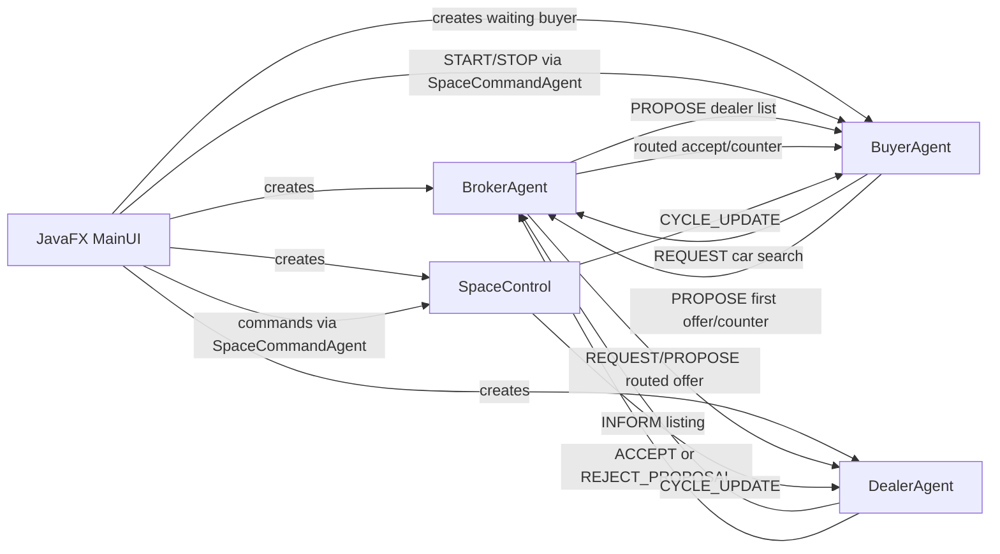
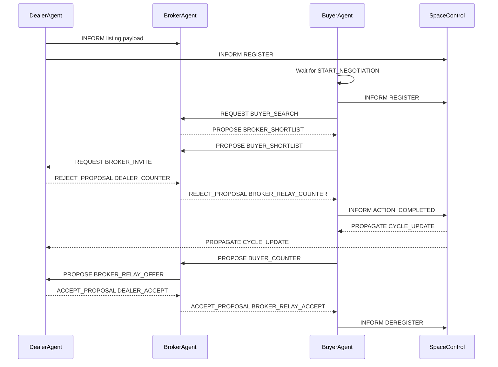
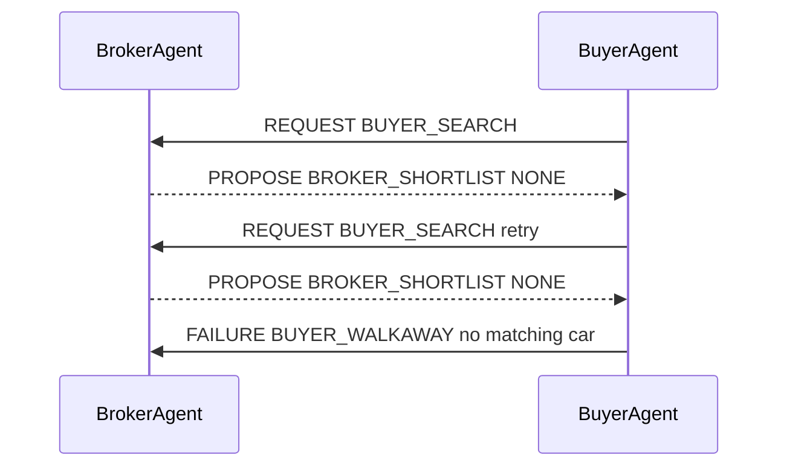
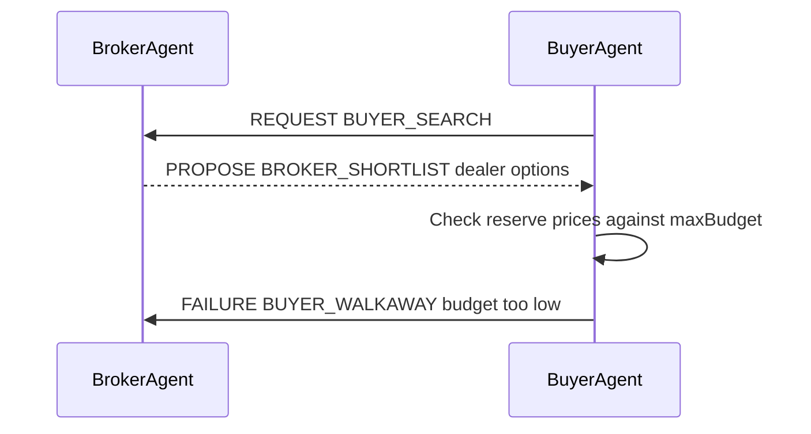

# Automated Car Negotiation System

This project is a JADE-based multi-agent car marketplace. Dealer agents list cars, buyer agents search for matching cars, the broker agent matches buyers to dealers and records outcomes, and a space-control agent manages negotiation cycles. A JavaFX interface is used to create agents, configure negotiation strategies, control the simulation, and view logs/metrics.

Negotiation is broker-routed: buyers do not contact dealers directly. Offers are represented as multi-attribute terms containing price, warranty months, and delivery days, then routed through the broker as ACL messages.

## Project Goals

- Simulate autonomous buyer-dealer negotiation using JADE agents.
- Show real ACL messages between agents using the JADE Sniffer.
- Compare different time-based negotiation strategies such as Boulware, Conceder, and Linear.
- Record performance data such as deal count, no-deal count, average deal price, average rounds, and success rate.
- Handle edge cases gracefully instead of letting agents loop forever.

## Setup Instructions

### Prerequisites

- Java 17
- Maven

### Installation

1. Clone the repository:

   ```bash
   git clone https://github.com/MiyukiVigil/COS30018-Assignment.git
   ```

2. Navigate to the project directory:

   ```bash
   cd COS30018-Assignment
   ```

3. Install dependencies:

   ```bash
   mvn install
   ```

4. JADE is declared as a normal Maven dependency. If your Maven environment cannot resolve the JADE repository, install `jade.jar` locally as a fallback.

   Linux/macOS:

   ```bash
   mvn install:install-file -Dfile=jade.jar -DgroupId=com.tilab.jade -DartifactId=jade -Dversion=4.6.0 -Dpackaging=jar
   ```

   Windows:

   ```bash
   mvn install:install-file "-Dfile=jade.jar" "-DgroupId=com.tilab.jade" "-DartifactId=jade" "-Dversion=4.6.0" "-Dpackaging=jar"
   ```

## Running the Application

Start the JavaFX application with:

```bash
mvn javafx:run
```

## Runtime Defaults

Runtime defaults are loaded from `src/main/resources/negotiation-defaults.properties`. The file controls broker fees, commission, session timeout, strategy defaults, negotiation limits, and the starter weights for multi-attribute utility scoring. The JavaFX settings panel loads those defaults on startup and still lets you override strategy values for newly created agents.

Current default values include a RM50 broker fixed fee, 5% commission, 120-second session timeout, Boulware-to-Conceder switching at cycle 3, 20 deadline cycles, buyer starting offer at 70% of budget, dealer reserve at 70% of retail price, 10 rounds per dealer, 2 search retries, and default utility weights of 70% price, 20% warranty, and 10% delivery.

## Demo Flow

1. Register one or more dealer agents in the Dealer Portal.
2. Add buyer agents in the Buyer Portal. Buyers are created in a waiting state and do not negotiate immediately.
3. Alternatively, press `Demo Setup` in the global controls to automatically create three well-stocked sample dealers and a larger mix of waiting buyers.
4. Use the global controls above the tabs to manage the demo from any screen.
5. Press `Start` to begin all waiting buyer negotiations.
6. Use `Pause` / `Resume` to control market cycles during the demo.
7. Use `Step Cycle` to manually advance the market one cycle at a time.
8. Use `Sniffer` to open the JADE Sniffer and observe ACL messages.
9. Use `Stop` to terminate active buyer negotiations and record them as `NO_DEAL;USER_STOPPED`.
10. Use `Clear Session` to reset the broker, space-control cycle, active agents, metrics, logs, and visualisers before starting another run.

Manual buyer agents can be created from the Buyer Portal by enabling manual negotiation mode. Those buyers still use the same broker-routed protocol, but the Manual Negotiation page lets the user choose the dealer, send the first offer, counter dealer offers, accept a counter, or walk away.

Demo Agents
----------

The demo setup creates a set of example agents that represent common marketplace roles and negotiation behaviours. Names follow patterns like `DemoAuto*` for dealers and `DemoBuyer*` for buyers; a numeric suffix is appended for each instance (e.g., `DemoAutoA-1`, `DemoBuyerPremium-1`). The demo agents are intended to help exercise different negotiation edge cases:

- `DemoAutoA-*`: Well-stocked Camry dealer. Most demo buyers negotiate here so the run shows varied buyer behaviour without frequent stock-out failures.
- `BudgetCars-*`: Well-stocked Civic dealer that tests budget-sensitive buyers and mid-range deals.
- `FamilyDrive-*`: Well-stocked SUV dealer (Honda CR-V) representing higher-priced inventory and larger-budget buyers.

- `DemoBuyerPremium-*`: High-budget buyer who can stretch to pay near retail — useful to validate successful deals and commission calculations.
- `DemoBuyerStubborn-*`: Conservative/boulware-style buyer who concedes slowly; useful to test negotiations that may drag and trigger strategy switching.
- `DemoBuyerTight-*`: Budget-constrained buyer that often results in `NO_DEAL;BUDGET_TOO_LOW` outcomes.
- `DemoBuyerCivic-*`: Buyer specifically targeting lower-priced models (e.g., Civic) with about RM10,000 headroom, used to exercise narrow-budget pacing.
- `DemoBuyerSUV-*`: Buyer targeting SUVs (e.g., CR-V) with about RM10,000 headroom so the cycle shift remains visible before closure.
- `DemoBuyerStretch-*`: High-budget SUV buyer that stresses multi-round negotiation for larger-ticket items.
- `DemoBuyerBudget-*`: Intentionally underfunded buyer to exercise the no-deal code paths and ensure broker records failures.
- `DemoBuyerOverdrive-*`: Aggressive buyer with a dedicated faster config. It starts stronger and switches strategy sooner than normal buyers, but still uses paced rounds so it does not close instantly.

Most demo agent archetypes inherit the Market Analysis settings, while `DemoBuyerOverdrive-*` applies a dedicated faster buyer config. They exist to provide repeatable scenarios for testing strategy behaviour, sniffer visualization, and performance metrics.

## Main Files

| File | Purpose |
| --- | --- |
| `src/main/java/org/example/MainUI.java` | JavaFX GUI, JADE container setup, agent creation, global controls, charts, logs, and negotiation configuration inputs. |
| `src/main/java/org/example/agents/BuyerAgent.java` | Buyer-side search and negotiation logic. Handles waiting/start/stop, offers, dealer fallback, retries, and no-deal cases. |
| `src/main/java/org/example/agents/DealerAgent.java` | Dealer-side listing and negotiation logic. Calculates target sale price and accepts/rejects buyer offers. |
| `src/main/java/org/example/agents/BrokerAgent.java` | Marketplace broker. Stores inventory, answers buyer searches, records transactions and performance metrics. |
| `src/main/java/org/example/agents/SpaceControl.java` | Cycle manager. Broadcasts market cycle updates and supports pause/resume/step controls. |
| `src/main/java/org/example/agents/SpaceCommandAgent.java` | Short-lived helper agent used by the UI to send ACL commands into the JADE platform. |
| `src/main/java/org/example/agents/NegotiationConfig.java` | Shared configuration object for strategy, deadline, reserve price, starting offer, retries, and round limits. |
| `src/main/java/org/example/agents/NegotiationTerms.java` | Immutable multi-attribute offer value containing price, warranty months, and delivery days. Also serializes/deserializes ACL payload segments. |
| `src/main/java/org/example/agents/UtilityPreferences.java` | Weighted additive utility model used by buyers and dealers to score price, warranty, and delivery terms. |
| `src/main/java/org/example/agents/OpponentModel.java` | Offer-history model that predicts the opponent's next price and how many rounds they may need to reach the current target. |
| `src/main/java/org/example/agents/AppConfig.java` | Loads typed runtime defaults from `negotiation-defaults.properties` with hardcoded fallbacks. |
| `src/main/resources/negotiation-defaults.properties` | External runtime settings for broker fees, timeout scanning, strategy defaults, and utility defaults. |

## User Interface

### Global Controls

The controls above the tabs are available from every screen:

- `Start`: sends `START_NEGOTIATION` to all waiting buyer agents.
- `Demo Setup`: creates a stress-test scenario with 3 well-stocked dealers and 8 waiting buyers, including varied Camry buyers, RM10,000-headroom buyers, one intentional low-budget failure, visible strategy switching, and extra rounds so negotiations do not fail immediately at the switch.
- `Pause` / `Resume`: sends `PAUSE` or `RESUME` to `SpaceControl`.
- During pause, the UI also sends `PAUSE_NEGOTIATION` / `RESUME_NEGOTIATION` to active buyers, dealers, and the broker so broker-routed offer messages are held and resumed consistently.
- `Stop`: sends `STOP_NEGOTIATION` to buyer agents and records `NO_DEAL;USER_STOPPED`.
- `Clear Session`: kills current buyer/dealer agents, clears broker inventory and sessions, resets the cycle count, and clears UI metrics/logs/visualisers for a fresh run.
- `Step Cycle`: sends `STEP` to `SpaceControl` and advances one cycle immediately.
- `Speed`: sends `SET_SPEED` to `SpaceControl` to change the automatic cycle delay.
- `Sniffer`: launches the JADE Sniffer visual message tool.

### Dashboard

Shows system-level information:

- active buyers
- active dealers
- closed deals
- broker revenue
- negotiation price trajectory chart
- live listing board
- active session view
- market and agent visualisers
- agent performance summary
- setup status messages

### Participants Page

The Participants page contains matched Dealer Portal and Buyer Portal panels. Register dealers first so their inventory is available to the broker, then add buyers in a waiting state. Buyers do not negotiate immediately; they wait until the global `Start` button is pressed.

### Buyer Portal

Creates buyer agents with a desired vehicle and maximum budget. Optional manual negotiation mode lets the user drive that buyer's offers from the Manual Negotiation page.

Inputs:

- buyer name
- desired car
- maximum budget
- manual negotiation mode toggle

### Manual Negotiation

Controls buyers that were created with manual negotiation mode enabled.

Main actions:

- select a manual buyer
- choose a shortlisted dealer
- send the first offer
- view the dealer counter
- send a counter offer
- accept a counter by sending the selected price back through the broker
- walk away from the active session

Manual actions are sent to the buyer as `MANUAL_ACTION` messages. The buyer then sends normal broker protocol messages such as `BUYER_SHORTLIST`, `BUYER_COUNTER`, or `BUYER_WALKAWAY`, so manual play still appears in the broker log, performance metrics, and JADE Sniffer.

### Dealer Portal

Creates dealer agents and lists inventory with the broker. Dealer listings include the retail price and stock quantity; the configured reserve percentage is used to calculate the dealer reserve price.

Inputs:

- dealer name
- car model
- retail price
- stock quantity

### Market Analysis

Configures negotiation behaviour before creating agents:

- strategy: `BOULWARE`, `CONCEDER`, or `LINEAR`
- deadline cycles
- buyer starting offer percentage
- dealer reserve percentage
- maximum rounds per dealer
- search retry limit
- stuck-round threshold
- manual dealer price adjustment

### Activity Log

Displays filtered system events, including search results, offers, counters, acceptances, no-deal outcomes, revenue, and performance metrics.

## Agent Architecture



## Agent Responsibilities

### BuyerAgent

The buyer agent represents a customer looking for a specific car under a maximum budget.

Main behaviour:

1. Waits until it receives `START_NEGOTIATION`.
2. Sends `REQUEST` to the broker for the desired car.
3. Receives dealer options from the broker.
4. Sorts and limits dealer options, then checks whether any dealer reserve price is within the buyer budget.
5. Chooses up to three dealer options and sends first-offer terms through the broker.
6. Handles `REJECT_PROPOSAL` counter-offers.
7. Records dealer counters in `OpponentModel`, logs prediction summaries, and may hold firm if the dealer is predicted to come down to the buyer's current offer.
8. Sends revised multi-attribute terms if still negotiating.
9. In manual mode, waits for user `MANUAL_ACTION` commands after the shortlist and counter-offer stages.
10. Handles `ACCEPT_PROPOSAL`, logs the purchase, deregisters from `SpaceControl`, and terminates.
11. Sends no-deal confirmation if budget, retry, or round limits are exceeded, then terminates.

Important state:

- `desiredCar`: requested car model.
- `maxBudget`: maximum amount the buyer can pay.
- `initialOffer`: starting offer based on configured buyer start percentage.
- `currentWillingOffer`: buyer's current cycle/round-paced offer.
- `currentTerms`: current price, warranty, and delivery offer terms.
- `dealers`: dealer options returned by the broker.
- `negotiationRound`: number of negotiation rounds with the current dealer.
- `searchRetries`: number of broker search retries.
- `negotiationStarted`: controls whether the buyer waits or starts immediately.
- `dealerModel`: `OpponentModel` tracking dealer counter-offer trend for the active dealer.
- `isManualStrategy`: controls whether the buyer waits for UI commands during negotiation.

### DealerAgent

The dealer agent represents a seller with car stock.

Main behaviour:

1. Registers its car listing with the broker.
2. Registers with `SpaceControl` to receive cycle updates.
3. Calculates a dynamic target price from market cycles and local negotiation rounds.
4. Receives buyer first-offer terms from the broker.
5. Selects whether to engage the buyer; clearly unworkable first offers can be rejected.
6. Records buyer offers in a per-session `OpponentModel`, logs prediction summaries, and may hold firm if the buyer is predicted to reach the dealer target soon.
7. Accepts if the buyer terms meet price/utility targets.
8. Rejects with multi-attribute counter-terms if the buyer offer is too low.
9. Reduces stock after a successful sale.
10. Notifies the broker about pending sessions when stock reaches zero.
11. Terminates when stock reaches zero.

Important state:

- `retailPrice`: initial listed price.
- `minPrice`: reserve price or lowest acceptable price.
- `currentTargetPrice`: current asking target based on cycle progress, negotiation rounds, strategy, and reserve protection.
- `stockCount`: remaining stock.
- `manualTargetPrice`: optional manual price override from the UI.
- `activeSessions`: per-session state for concurrent buyer negotiations, including latest terms, rounds, status, and buyer opponent model.

### BrokerAgent

The broker agent acts as the marketplace middleman.

Main behaviour:

1. Receives dealer listings through `INFORM`.
2. Stores car model, dealer name, retail price, reserve price, and stock.
3. Receives buyer search requests through `REQUEST`.
4. Replies with matching dealers using `PROPOSE`, ranked by dealer success history and then lowest listed price.
5. Creates negotiation sessions from buyer shortlists and routes every offer, counter, accept, and walkaway message.
6. Handles dealer rejection, dealer sold-out notices, duplicate sessions, timeouts, fixed fees, commission, total revenue, and performance metrics.

Performance metrics logged:

- deals closed
- no-deal count
- average deal price
- average successful negotiation rounds
- success rate

### SpaceControl

`SpaceControl` manages market time.

Main behaviour:

1. Tracks active buyer and dealer agents.
2. Receives `REGISTER` and `DEREGISTER`.
3. Broadcasts `CYCLE_UPDATE` messages.
4. Advances cycles when market actions complete.
5. Supports `PAUSE`, `RESUME`, `STEP`, `SET_SPEED`, and `RESET_SESSION`.

The cycle number is important because buyer and dealer prices are calculated using time-dependent concession formulas.

Automatic cycle advances are delayed slightly so the demonstration is readable in the UI and JADE Sniffer. `Step Cycle` still advances immediately for manual demos.

### SpaceCommandAgent

This is a short-lived helper agent. JavaFX itself is not a JADE agent, so it cannot directly participate in JADE messaging. `SpaceCommandAgent` is created temporarily by the UI to send a single ACL message, then deletes itself.

Examples:

- UI creates `SpaceCommandAgent` to send `PAUSE` to `space`.
- UI creates `SpaceCommandAgent` to send `START_NEGOTIATION` to a buyer.
- UI creates `SpaceCommandAgent` to send `PRICE_ADJUSTMENT` to a dealer.

### NegotiationTerms

`NegotiationTerms` is the shared offer object used in broker-routed payloads.

Fields:

- `price`: offered car price in RM.
- `warrantyMonths`: warranty length included in the offer.
- `deliveryDays`: delivery time included in the offer.

Payload format:

```text
price:warrantyMonths:deliveryDays
```

Legacy price-only payloads are still accepted. When warranty or delivery is missing, defaults are loaded from `AppConfig`.

### UtilityPreferences

`UtilityPreferences` scores non-price negotiation quality using weighted additive utility.

Buyer utility rewards:

- lower price
- longer warranty
- shorter delivery

Dealer utility rewards:

- higher price above reserve
- shorter warranty obligation
- longer delivery flexibility

The current defaults are `0.70` price, `0.20` warranty, and `0.10` delivery. Weights are normalized inside the class.

### OpponentModel

`OpponentModel` records the last few observed opponent prices and estimates the offer trend.

Main behaviour:

1. Stores chronological offer history.
2. Calculates average price change per round over a rolling window of up to 5 offers.
3. Predicts the opponent's next offer.
4. Estimates how many more rounds the opponent may need to reach a target price.
5. Produces human-readable prediction summaries for the Activity Log.

Usage:

- `BuyerAgent` models dealer counter-offers. If the dealer is predicted to come down to the buyer's current willing offer, the buyer can hold firm instead of increasing.
- `DealerAgent` models buyer offers per session. If the buyer is predicted to reach the dealer target soon, the dealer can hold firm instead of conceding further.

## ACL Communication Protocol

| Sender | Receiver | Performative | Ontology | Content | Meaning |
| --- | --- | --- | --- | --- | --- |
| Dealer | Broker | `INFORM` | empty | `car;retailPrice;stock;reservePrice` | Dealer lists inventory. |
| Buyer | Broker | `REQUEST` | `BUYER_SEARCH` | `searchId;desiredCar` | Buyer searches for matching car. |
| Broker | Buyer | `PROPOSE` | `BROKER_SHORTLIST` | `searchId;dealer:price:reserve,...` or `searchId;NONE` | Broker returns matching dealers. |
| Buyer | Broker | `PROPOSE` | `BUYER_SHORTLIST` | `sessionId;dealerName;price:warrantyMonths:deliveryDays;buyerReserve;carModel` | Buyer selects a dealer and starts a broker session. |
| Broker | Dealer | `REQUEST` | `BROKER_INVITE` | `sessionId;buyerName;carModel;price:warrantyMonths:deliveryDays` | Broker routes the first buyer offer. |
| Dealer | Broker | `REJECT_PROPOSAL` | `DEALER_REJECT` | `sessionId;reason` | Dealer declines to engage a low-value first offer. |
| Dealer | Broker | `REJECT_PROPOSAL` | `DEALER_COUNTER` | `sessionId;price:warrantyMonths:deliveryDays` | Dealer counters through broker. |
| Dealer | Broker | `INFORM` | `DEALER_SOLD_OUT` | `sessionId1,sessionId2,...` | Dealer reports pending sessions that can no longer be served after stock reaches zero. |
| Broker | Buyer | `REJECT_PROPOSAL` | `BROKER_RELAY_COUNTER` | `sessionId;dealerName;price:warrantyMonths:deliveryDays` | Broker routes dealer counter to buyer. |
| Buyer | Broker | `PROPOSE` | `BUYER_COUNTER` | `sessionId;price:warrantyMonths:deliveryDays` | Buyer counters through broker. |
| Broker | Dealer | `PROPOSE` | `BROKER_RELAY_OFFER` | `sessionId;buyerName;carModel;price:warrantyMonths:deliveryDays` | Broker routes buyer counter to dealer. |
| Dealer | Broker | `ACCEPT_PROPOSAL` | `DEALER_ACCEPT` | `sessionId;price:warrantyMonths:deliveryDays` | Dealer accepts through broker. |
| Broker | Buyer | `ACCEPT_PROPOSAL` | `BROKER_RELAY_ACCEPT` | `sessionId;dealerName;price:warrantyMonths:deliveryDays` | Broker confirms successful deal. |
| Broker | Buyer | `FAILURE` | `BROKER_SESSION_REJECTED` | `sessionId;reason` | Broker tells the buyer a session was rejected, duplicated, or timed out. |
| Broker | Buyer | `INFORM` | `BROKER_RELAY_SOLD_OUT` | `sessionId;dealerName` | Broker tells the buyer the dealer sold out so the buyer can try the next dealer. |
| Buyer | Broker | `FAILURE` | `BUYER_WALKAWAY` | `sessionId;reason[;car;budget]` | Buyer reports failed negotiation or pre-session failure. |
| Buyer/Dealer | SpaceControl | `INFORM` | `REGISTER` | empty | Agent joins cycle updates. |
| Buyer/Dealer | SpaceControl | `INFORM` | `DEREGISTER` | empty | Agent leaves cycle updates. |
| Buyer | SpaceControl | `INFORM` | `ACTION_COMPLETED` | empty | Negotiation action completed; cycle may advance. |
| Dealer | SpaceControl | `INFORM` | `ACTION_COMPLETED` | empty | Dealer completed a brokered action; cycle may advance. |
| SpaceControl | Buyer/Dealer | `PROPAGATE` | `CYCLE_UPDATE` | `cycleNumber` | Broadcasts new market cycle. |
| UI helper | Buyer | `INFORM` | `START_NEGOTIATION` | empty | Starts waiting buyer. |
| UI helper | Buyer | `INFORM` | `STOP_NEGOTIATION` | empty | Stops buyer negotiation. |
| UI helper | Buyer | `INFORM` | `MANUAL_ACTION` | `SHORTLIST;dealer;price`, `COUNTER;price`, `ACCEPT;price`, or `WALKAWAY;` | Sends manual negotiation input to a manual buyer. |
| UI helper | Buyer/Dealer/Broker | `INFORM` | `PAUSE_NEGOTIATION` / `RESUME_NEGOTIATION` | empty | Holds or resumes pausable broker-routed negotiation messages. |
| UI helper | Dealer | `INFORM` | `PRICE_ADJUSTMENT` | `newPrice` | Manually adjusts dealer target price. |
| UI helper | SpaceControl | `INFORM` | `PAUSE`, `RESUME`, `STEP`, `SET_SPEED` | empty or delay milliseconds | Controls market cycle flow. |
| UI helper | Broker/SpaceControl | `INFORM` | `RESET_SESSION` | empty | Clears broker state and resets the market cycle for a fresh run. |

## Sequence Diagrams

### Successful Negotiation



### No Matching Car



### Budget Too Low



## Negotiation Model

The system uses time-dependent concession. A negotiation strategy controls how quickly the buyer and dealer change their prices as the deadline approaches.

The current implementation combines this time-dependent price concession with multi-attribute utility scoring and opponent trend prediction. Price still drives the main concession curve, while warranty and delivery are adjusted alongside price and can make an offer acceptable even when the price is not exactly at the current target.

Definitions:

| Symbol | Meaning |
| --- | --- |
| `t` | Current cycle age of the negotiation. |
| `T` | Deadline cycles. |
| `beta` | Strategy parameter controlling concession speed. |
| `P_retail` | Dealer retail price. |
| `P_reserve` | Dealer minimum acceptable price. |
| `B_max` | Buyer maximum budget. |
| `B_initial` | Buyer initial offer. |

The normalized time ratio is:

```text
r = t / T
```

The concession factor is:

```text
concessionFactor = r ^ beta
```

Because `r` is between `0` and `1`, different beta values create different concession shapes.

The active beta can change during a negotiation. Agents start with the selected strategy, then switch to the configured second strategy when the local cycle reaches the switch threshold:

```text
effectiveStrategy(t) =
    initialStrategy, if t < switchCycle
    switchStrategy,  if t >= switchCycle

beta = beta(effectiveStrategy(t))
```

Example: the runtime default starts with `BOULWARE` and switches to `CONCEDER` at cycle `3`. Demo Setup may create faster buyer configs so the strategy change is visible during a quick classroom run.

## Strategy Values

The strategy values are defined in `NegotiationConfig.java`.

| Strategy | Beta | Behaviour |
| --- | ---: | --- |
| `BOULWARE` | `2.0` | Concedes slowly at the beginning and faster near the deadline. |
| `CONCEDER` | `0.45` | Concedes quickly at the beginning. |
| `LINEAR` | `1.0` | Concedes at a constant rate. |

### Why Beta Changes Behaviour

For early cycle time, such as `r = 0.2`:

```text
Boulware: 0.2 ^ 2.0  = 0.04
Linear:   0.2 ^ 1.0  = 0.20
Conceder: 0.2 ^ 0.45 = about 0.48
```

This means Boulware only makes about 4% of its total concession early, while Conceder makes about 48%. That is why Boulware is firm early and Conceder gives in quickly.

## Dealer Formula

The dealer starts near the retail price and gradually moves down toward the reserve price. Like the buyer, the dealer also considers local negotiation rounds so fast broker messages do not keep showing the same early target price. Once a dealer has conceded, later cycle updates never raise that dealer's remembered target.

```text
DealerTarget(p) = P_retail - (P_retail - P_reserve) * (p / T_effective) ^ beta
```

`p` is the greater of elapsed market cycles and local negotiation rounds. For narrow retail-to-reserve windows, the dealer stretches `T_effective` so it does not drop to reserve too quickly.

In the current code, a narrow dealer window means the retail-to-reserve gap is no more than 30% of retail price. In that case, the effective dealer deadline is stretched to three times the configured deadline.

In code:

```java
double concessionFactor = Math.pow((double) p / effectiveDeadlineCycles, config.betaForCycle(strategyStep));
int cycleTarget = (int) (retailPrice - ((retailPrice - minPrice) * concessionFactor));
currentTargetPrice = Math.min(currentTargetPrice, Math.max(minPrice, cycleTarget));
```

Interpretation:

- At `p = 0`, the target is close to `P_retail`.
- At `p = T_effective`, the target reaches `P_reserve`.
- The dealer never goes below reserve price.
- The dealer target never increases after round-based concession has lowered it.
- If the UI sends a manual price adjustment, the dealer uses that target while still protecting the reserve price.
- Dealer counter terms lower warranty and lengthen delivery as the dealer concedes on price.

Example:

```text
Retail price: RM100,000
Reserve price: RM70,000
Deadline: 50 cycles
Current cycle: 10
Strategy: Boulware beta = 2.0

r = 10 / 50 = 0.2
concessionFactor = 0.2 ^ 2 = 0.04
DealerTarget = 100,000 - (100,000 - 70,000) * 0.04
DealerTarget = 100,000 - 30,000 * 0.04
DealerTarget = RM98,800
```

With Conceder:

```text
concessionFactor = 0.2 ^ 0.45 = about 0.48
DealerTarget = 100,000 - 30,000 * 0.48
DealerTarget = about RM85,600
```

So the Conceder dealer lowers price much faster.

## Buyer Formula

The buyer starts from a lower initial offer and gradually increases toward the maximum budget. The displayed offer uses market cycle progress, but counter-offers also consider the local negotiation round so fast message exchanges do not repeat the same early price. Once a buyer accelerates, later cycle updates never reduce that buyer's remembered willing offer.

```text
BuyerOffer(p) = B_initial + (B_max - B_initial) * (p / T_effective) ^ beta
```

`p` is the greater of elapsed market cycles and local negotiation rounds. For narrow affordability windows, the buyer stretches `T_effective` so high-money agents do not immediately jump to their maximum offer.

In the current code, a narrow buyer window means the affordability gap is no more than 30% of the buyer budget. In that case, the effective buyer deadline is stretched to three times the configured deadline.

In code:

```java
double concessionFactor = Math.pow((double) p / effectiveDeadlineCycles, config.betaForCycle(strategyStep));
int cycleOffer = (int) (initialOffer + ((maxBudget - initialOffer) * concessionFactor));
currentWillingOffer = Math.max(currentWillingOffer, Math.min(cycleOffer, maxBudget));
```

Interpretation:

- At `t = 0`, the buyer starts around `B_initial`.
- At `p = T_effective`, the buyer reaches `B_max`.
- The buyer never offers more than the maximum budget.
- If the buyer has a narrow headroom window over the target listing, the effective deadline is stretched to keep negotiation from ending immediately.
- Buyer terms improve warranty and shorten delivery as the buyer concedes on price.

Example:

```text
Maximum budget: RM90,000
Initial offer: 70% of budget = RM63,000
Deadline: 50 cycles
Current cycle: 10
Strategy: Boulware beta = 2.0

r = 10 / 50 = 0.2
concessionFactor = 0.2 ^ 2 = 0.04
BuyerOffer = 63,000 + (90,000 - 63,000) * 0.04
BuyerOffer = 63,000 + 27,000 * 0.04
BuyerOffer = RM64,080
```

With Conceder:

```text
concessionFactor = 0.2 ^ 0.45 = about 0.48
BuyerOffer = 63,000 + 27,000 * 0.48
BuyerOffer = about RM75,960
```

So the Conceder buyer increases their offer much faster.

## Deal Decision Rule

A dealer accepts when the buyer's terms meet either the price target or the dealer's utility threshold:

```text
BuyerOffer >= DealerTarget
or
DealerUtility(buyerTerms) >= acceptanceThreshold
```

If true:

- Dealer sends `ACCEPT_PROPOSAL` with `DEALER_ACCEPT` to Broker.
- Broker sends `ACCEPT_PROPOSAL` with `BROKER_RELAY_ACCEPT` to Buyer.
- Broker records the transaction.
- Dealer stock decreases by one.
- The buyer terminates after receiving the broker's acceptance relay.
- If dealer stock reaches zero, the dealer terminates and the broker removes that listing from inventory.

If false:

- Dealer sends `REJECT_PROPOSAL` with `DEALER_COUNTER` to Broker.
- Broker relays it to Buyer as `BROKER_RELAY_COUNTER`.
- The reject content contains the dealer's current target price as a counter-offer.
- Buyer decides whether to continue, accelerate, move to another dealer, or report no deal.

## Stuck Negotiation Rule

The buyer has a configurable `stuckRoundsBeforeAcceleration` setting. If the dealer keeps rejecting and the round count reaches the threshold, the buyer moves faster toward the maximum budget.

Code logic:

```java
currentWillingOffer = Math.min(
    maxBudget,
    currentWillingOffer + Math.max(1, (maxBudget - currentWillingOffer) / 2)
);
```

This halves the remaining gap between the current offer and maximum budget. It helps prevent long negotiations from dragging indefinitely.

## Narrow Price Window Pacing

Some high-money agents can afford a listing with only a narrow negotiation headroom. Without pacing, those agents can satisfy the acceptance rule almost immediately, making cycle shifts and strategy changes hard to observe.

To avoid that, buyers and dealers stretch their effective deadline when the relevant price window is at or below 30% of the buyer budget or dealer retail price:

- buyers compare maximum budget against the active dealer listing price;
- dealers compare retail price against reserve price;
- round-based movement still occurs, but the per-round step is smaller;
- affordable dealer counters can close after a few rounds even if the utility score is low because the price is near the buyer's maximum budget;
- acceptable utility alone does not close a narrow-window deal until a few rounds or cycles have passed.

This keeps demos and custom low-gap scenarios from ending before the negotiation trajectory is visible.

## Dynamic Configuration

`NegotiationConfig` is passed into buyer and dealer agents when they are created.

Configurable values:

- `strategy`: Boulware, Conceder, or Linear.
- `strategySwitchCycle`: cycle number where the agent changes strategy. Use `0` to effectively disable switching.
- `switchStrategy`: strategy used after the switch cycle.
- `deadlineCycles`: maximum cycle value used in formulas.
- `buyerStartPercent`: buyer initial offer percentage.
- `dealerReservePercent`: dealer reserve price percentage.
- `maxRoundsPerDealer`: failed rounds allowed before trying the next dealer.
- `maxSearchRetries`: broker search retries before giving up.
- `stuckRoundsBeforeAcceleration`: round threshold for accelerated buyer concession.
- `manualDealerTargetPercent`: multiplier applied to dealer targets for manual/default adjustment.
- Utility defaults in `negotiation-defaults.properties`: price, warranty, and delivery weights for multi-attribute negotiation.

Because configuration is passed during agent creation, you can run different experiments without editing Java code.

## Edge Case Rules

| Edge Case | Behaviour |
| --- | --- |
| Buyer's budget is too low | Buyer checks dealer reserve prices and immediately reports `NO_DEAL;BUDGET_TOO_LOW`. |
| No matching car found | Buyer retries up to the configured retry limit, then reports `NO_DEAL;NO_MATCHING_CAR`. |
| Negotiation stuck | Buyer accelerates concession after the configured stuck-round threshold. |
| Too many failed rounds | Buyer moves to another dealer, up to three dealers, or reports `NO_DEAL;MAX_ROUNDS_REACHED`. |
| Dealer rejects first offer | Only clearly unworkable first offers are rejected; otherwise the dealer sends a counter-offer. |
| Broker session is duplicated | Broker rejects the duplicate active session with `BROKER_SESSION_REJECTED;DUPLICATE_SESSION`. |
| Broker session times out | Broker marks the session as `TIMEOUT`, logs a no-deal, and notifies the buyer with `BROKER_SESSION_REJECTED`. |
| User presses Stop | Buyer reports `NO_DEAL;USER_STOPPED`. |
| User presses Clear Session | UI kills buyer/dealer agents, resets broker and space-control state, clears metrics/logs/visualisers, and keeps the app ready for a new setup. |
| Dealer stock reaches zero | Dealer logs out of stock, notifies the broker of pending sessions with `DEALER_SOLD_OUT`, deregisters from `SpaceControl`, terminates, and the broker removes the listing from inventory. |
| Dealer sells out during another buyer's session | Broker closes affected sessions as no-deals and sends `BROKER_RELAY_SOLD_OUT` so buyers can try the next dealer. |
| Buyer closes a deal | Buyer logs the purchase, deregisters from `SpaceControl`, terminates, and the UI removes it from active buyer lists. |
| New dealer joins mid-simulation | Broker stores the listing, and future buyer searches can find the new dealer. |
| Manual price change | UI sends `PRICE_ADJUSTMENT` to a dealer, and the dealer updates its target price while respecting reserve price. |
| Manual buyer walks away | Buyer sends `BUYER_WALKAWAY;MANUAL_WALKAWAY`, broker records a no-deal, and the manual controls enter a terminal state. |

## JADE Sniffer

The JADE Sniffer is used to show real ACL messages between agents. It is useful for proving that the system is using agent communication rather than only Java method calls or UI logs.

The app launches Sniffer only when the `Sniffer` button is pressed. It preloads `broker`, `space`, and the currently registered buyer/dealer agents so the demo can show broker-routed traffic across the broker, buyers, dealers, and cycle controller without opening extra Sniffer windows during startup or agent creation.

How to use it:

1. Start the application.
2. Create the agents first by pressing `Demo Setup` or by adding custom dealers and buyers.
3. Open Sniffer using the global `Sniffer` button before pressing `Start`.
4. The app preselects the main live agents:
   - `broker`
   - `space`
   - buyer agent names
   - dealer agent names
5. Start negotiation.
6. Watch the arrows between agents.

Expected message arrows:

- Buyer to Broker: `BUYER_SEARCH`, `BUYER_SHORTLIST`, `BUYER_COUNTER`, `BUYER_WALKAWAY`
- Broker to Buyer: `BROKER_SHORTLIST`, `BROKER_RELAY_COUNTER`, `BROKER_RELAY_ACCEPT`, `BROKER_SESSION_REJECTED`, `BROKER_RELAY_SOLD_OUT`
- Broker to Dealer: `BROKER_INVITE`, `BROKER_RELAY_OFFER`
- Dealer to Broker: `DEALER_COUNTER`, `DEALER_ACCEPT`, `DEALER_SOLD_OUT`
- SpaceControl to Buyer/Dealer: `CYCLE_UPDATE`

If the Sniffer window appears empty, close old Sniffer windows, click `Sniffer` again, then start negotiation. If JADE prints `Agent not found... sniffOffAction` after a demo run, it means Sniffer was still monitoring a buyer/dealer that already finished and deleted itself; the negotiation result is not affected. Close old Sniffer windows before repeating a demo to avoid stale lifelines.

## Performance Metrics

The Broker logs performance after successful and failed negotiations:

```text
PERFORMANCE: Deals=2 | NoDeals=1 | AvgDeal=RM85000 | AvgRounds=2.5 | SuccessRate=66.7%
```

Metric meanings:

| Metric | Meaning |
| --- | --- |
| `Deals` | Number of completed purchases. |
| `NoDeals` | Number of failed negotiations. |
| `AvgDeal` | Average sale price of successful deals. |
| `AvgRounds` | Average negotiation rounds for successful deals. |
| `SuccessRate` | Deals divided by total attempts. |

Broker revenue is calculated from the values in `negotiation-defaults.properties`:

```text
BrokerEarning = fixedSessionFee + (FinalSalePrice * commissionRate)
```

By default the fixed session fee is `RM50` and commission is `5%` of the final sale price. The fixed fee is charged when a broker session starts; commission is charged only for successful deals. Pre-session failures such as no matching car or unaffordable reserve prices are logged as no-deals without a session fee.
